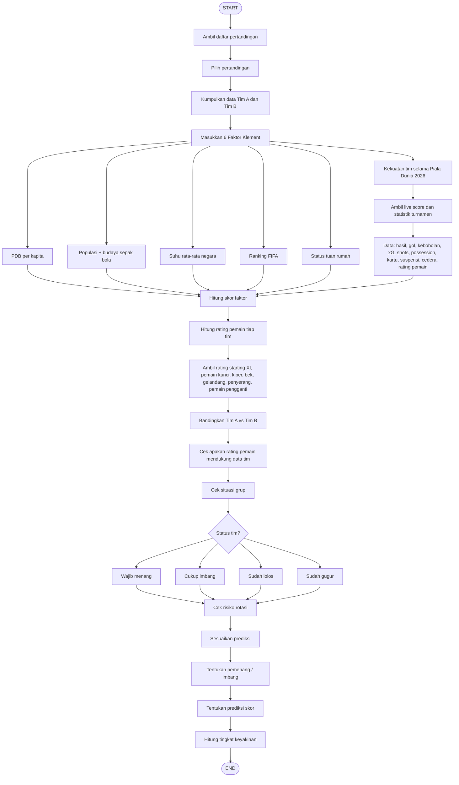

# PRD.md — Website Prediksi Pertandingan Piala Dunia 2026

## 1. Ringkasan Produk

Website ini adalah platform prediksi pertandingan sepak bola untuk Piala Dunia 2026. Sistem akan mengambil pertandingan, mengumpulkan data dua tim, menghitung skor berdasarkan **6 Faktor Klement**, lalu menggabungkannya dengan statistik turnamen, rating pemain, kondisi skuad, dan situasi grup untuk menghasilkan:

- Prediksi pemenang atau imbang
- Prediksi skor akhir
- Tingkat keyakinan prediksi
- Alasan prediksi berdasarkan data

Website ini tidak boleh menebak tanpa data. Jika data tidak tersedia, sistem wajib menampilkan status **data belum lengkap** atau **prediksi rendah keyakinan**.

---

## 2. Tujuan Produk

Tujuan utama website:

1. Membantu pengguna melihat prediksi pertandingan secara cepat dan mudah dipahami.
2. Menampilkan alasan prediksi berdasarkan data, bukan opini kosong.
3. Menggabungkan data negara, data tim, live score, performa turnamen, dan rating pemain.
4. Memberikan tampilan UI/UX modern yang menjelaskan proses prediksi secara transparan.
5. Menghindari hasil prediksi yang terlihat asal-asalan dengan menampilkan sumber, status data, dan tingkat keyakinan.

---

## 3. Target Pengguna

Target pengguna website:

- Penggemar sepak bola
- Penonton Piala Dunia 2026
- Pengguna yang ingin melihat analisis singkat sebelum pertandingan
- Pengguna yang ingin membandingkan kekuatan dua tim
- Content creator sepak bola yang membutuhkan bahan analisis cepat

---

## 4. Konsep Utama Website

Konsep website adalah **match prediction dashboard**.

User memilih atau membuka pertandingan, contoh:

```txt
Colombia vs Portugal
```

Lalu sistem menampilkan:

- Data Tim A dan Tim B
- Perbandingan 6 Faktor Klement
- Statistik performa selama Piala Dunia 2026
- Rating pemain dan rating per lini
- Kondisi cedera, suspensi, dan rotasi
- Situasi grup
- Hasil prediksi akhir

---

## 5. Scope Produk

### 5.1 Fitur yang Masuk Scope

Fitur utama yang harus ada:

1. Daftar pertandingan
2. Detail pertandingan
3. Perbandingan data Tim A vs Tim B
4. Perhitungan 6 Faktor Klement
5. Update data pertandingan dan live score
6. Statistik performa tim selama turnamen
7. Rating pemain per pertandingan
8. Koreksi rating berdasarkan cedera, suspensi, dan rotasi
9. Analisis situasi grup
10. Prediksi pemenang / imbang
11. Prediksi skor akhir
12. Tingkat keyakinan prediksi
13. Penjelasan alasan prediksi
14. Status kelengkapan data

### 5.2 Fitur yang Tidak Masuk Scope Awal

Fitur berikut tidak wajib dibuat di versi awal:

- Sistem login user
- Sistem komentar
- Sistem betting / taruhan
- Sistem pembayaran
- Forum komunitas
- Prediksi liga selain Piala Dunia 2026
- AI chat interaktif penuh

---

## 6. Prinsip Penting Produk

Website harus mengikuti prinsip berikut:

1. **Data first**  
   Semua prediksi harus berdasarkan data yang tersedia.

2. **No blind guessing**  
   Jika data tidak lengkap, sistem tidak boleh memaksa hasil seolah-olah pasti.

3. **Transparan**  
   User harus bisa melihat faktor apa saja yang membuat satu tim lebih unggul.

4. **Mudah dipahami**  
   Hasil prediksi harus bisa dimengerti pengguna umum, bukan hanya analis statistik.

5. **Live update**  
   Data pertandingan, skor, kartu, cedera, dan statistik turnamen harus bisa diperbarui secara otomatis.

6. **Prediksi bukan kepastian**  
   Website harus menjelaskan bahwa prediksi adalah estimasi berbasis data, bukan jaminan hasil.

---

## 7. Data yang Dibutuhkan

### 7.1 Data Pertandingan

Untuk setiap pertandingan, sistem membutuhkan:

- Nama Tim A
- Nama Tim B
- Tanggal pertandingan
- Jam pertandingan
- Stadion
- Lokasi pertandingan
- Babak / fase turnamen
- Grup jika masih fase grup
- Status pertandingan:
  - Belum mulai
  - Live
  - Selesai

---

### 7.2 Data Tim

Untuk setiap tim, sistem membutuhkan:

- Nama negara
- Ranking FIFA
- PDB per kapita
- Populasi negara
- Status sepak bola sebagai olahraga utama / budaya sepak bola
- Suhu rata-rata negara
- Status tuan rumah
- Riwayat pertandingan selama Piala Dunia 2026
- Statistik gol
- Statistik kebobolan
- Statistik xG
- Statistik shots
- Statistik shots on target
- Statistik possession
- Kartu kuning
- Kartu merah
- Suspensi
- Cedera pemain
- Rating pemain

---

### 7.3 Data Pemain

Untuk setiap pemain, sistem membutuhkan:

- Nama pemain
- Tim nasional
- Posisi
- Apakah starting XI
- Apakah pemain kunci
- Rating dari setiap pertandingan sebelumnya
- Rata-rata rating selama turnamen
- Status cedera
- Status suspensi
- Risiko rotasi
- Menit bermain
- Kontribusi gol / assist jika tersedia
- Rating spesifik sesuai posisi

---

## 8. Sumber Data

Sumber data yang disarankan:

1. Live score dari Google atau penyedia data sepak bola resmi.
2. Data ranking FIFA dari sumber resmi.
3. Data PDB per kapita dari sumber ekonomi resmi.
4. Data populasi dari sumber statistik resmi.
5. Data suhu rata-rata negara dari sumber iklim/cuaca resmi.
6. Data statistik pertandingan dari penyedia statistik sepak bola.
7. Data rating pemain dari penyedia rating pertandingan.
8. Data cedera dan suspensi dari laporan resmi turnamen atau media terpercaya.

Catatan penting:

- Jika Google live score tidak menyediakan API langsung, sistem harus menggunakan data provider resmi/legal yang bisa menampilkan data setara.
- Sistem harus menyimpan waktu terakhir update data.
- Setiap data penting harus memiliki status:
  - Available
  - Partial
  - Missing
  - Outdated

---

## 9. Alur Utama Sistem

```txt
START
  ↓
Ambil daftar pertandingan
  ↓
Pilih pertandingan
  ↓
Ambil data Tim A dan Tim B
  ↓
Hitung 6 Faktor Klement
  ↓
Ambil statistik Piala Dunia 2026
  ↓
Hitung rating pemain setiap tim
  ↓
Koreksi rating berdasarkan cedera, suspensi, dan rotasi
  ↓
Bandingkan kekuatan Tim A vs Tim B
  ↓
Cek situasi grup
  ↓
Gabungkan semua skor
  ↓
Tentukan pemenang / imbang
  ↓
Tentukan prediksi skor
  ↓
Hitung tingkat keyakinan
  ↓
Tampilkan hasil dan alasan prediksi
  ↓
END
```

---

## 10. Flowchart Sistem



---

## 11. Logika 6 Faktor Klement

### Faktor 1 — PDB per Kapita

Logika:

- Jika PDB per kapita Tim A lebih tinggi dari Tim B, maka Tim A +1.
- Jika PDB per kapita Tim B lebih tinggi dari Tim A, maka Tim B +1.
- Jika data tidak tersedia, faktor diberi status **Missing** dan tidak dihitung.

Output:

```txt
Tim A: +1 / +0
Tim B: +1 / +0
```

---

### Faktor 2 — Populasi + Budaya Sepak Bola

Logika:

- Tim dengan kombinasi populasi besar dan budaya sepak bola lebih kuat mendapat +1.
- Budaya sepak bola bisa dilihat dari:
  - Sepak bola sebagai olahraga utama
  - Jumlah pemain profesional
  - Prestasi historis
  - Popularitas sepak bola di negara tersebut

Output:

```txt
Tim A: +1 / +0
Tim B: +1 / +0
```

Catatan:

- Jika populasi besar tetapi sepak bola bukan olahraga utama, skor tidak otomatis unggul.
- Jika populasi lebih kecil tetapi budaya sepak bola sangat kuat, tim tersebut bisa lebih unggul.

---

### Faktor 3 — Suhu Rata-rata Negara

Logika:

- Suhu ideal pembanding adalah **14°C**.
- Tim yang suhu rata-rata negaranya lebih dekat ke 14°C mendapat +1.

Rumus sederhana:

```txt
Selisih Suhu = |Suhu Negara - 14|
```

Contoh:

```txt
Tim A: suhu 18°C → selisih 4
Tim B: suhu 25°C → selisih 11
Tim A lebih dekat ke 14°C → Tim A +1
```

---

### Faktor 4 — Ranking FIFA

Logika:

- Tim dengan ranking FIFA lebih tinggi mendapat +1.
- Dalam ranking FIFA, angka lebih kecil berarti posisi lebih tinggi.

Contoh:

```txt
Portugal ranking 6
Colombia ranking 12
Portugal lebih tinggi → Portugal +1
```

---

### Faktor 5 — Status Tuan Rumah

Logika:

- Jika salah satu tim berstatus tuan rumah, tim tersebut mendapat +1.
- Jika tidak ada yang tuan rumah, faktor ini netral.

Output:

```txt
Tim tuan rumah: +1
Bukan tuan rumah: +0
Tidak ada tuan rumah: netral
```

---

### Faktor 6 — Kekuatan Tim Selama Piala Dunia 2026

Faktor ini dihitung dari performa aktual selama turnamen.

Data yang digunakan:

- Hasil pertandingan sebelumnya
- Jumlah menang / imbang / kalah
- Gol
- Kebobolan
- Selisih gol
- xG
- Shots
- Shots on target
- Possession
- Kartu kuning
- Kartu merah
- Suspensi
- Cedera pemain
- Performa pemain
- Rating pemain setiap pertandingan

Logika:

- Tim dengan performa turnamen lebih kuat mendapat +1 pada Faktor Klement.
- Selain +1, performa turnamen juga masuk ke **Skor Statistik Turnamen** untuk perhitungan total.

---

## 12. Perhitungan Rating Pemain

### 12.1 Data Rating yang Diambil

Untuk setiap tim, sistem harus menghitung:

- Rata-rata rating starting XI
- Rata-rata rating pemain inti selama turnamen
- Rata-rata rating pemain kunci
- Rating kiper
- Rating bek
- Rating gelandang
- Rating penyerang
- Rating pemain pengganti penting

---

### 12.2 Rumus Rata-rata Rating Starting XI

```txt
Rata-rata Starting XI = Total rating 11 pemain starter / 11
```

Contoh:

```txt
Total rating starting XI = 77.0
Rata-rata = 77.0 / 11 = 7.0
```

---

### 12.3 Rumus Rating Per Lini

```txt
Rating Kiper = Rata-rata rating pemain posisi GK
Rating Bek = Rata-rata rating pemain posisi DEF
Rating Gelandang = Rata-rata rating pemain posisi MID
Rating Penyerang = Rata-rata rating pemain posisi FWD
```

---

### 12.4 Rating Pemain Kunci

Pemain kunci bisa ditentukan dari:

- Rating tertinggi
- Menit bermain tinggi
- Kontribusi gol / assist
- Peran penting di tim
- Status sebagai kapten atau pemain inti

Rumus sederhana:

```txt
Rating Pemain Kunci = Rata-rata rating 3 sampai 5 pemain paling berpengaruh
```

---

## 13. Koreksi Rating Berdasarkan Kondisi Pemain

Sistem harus menyesuaikan rating jika ada kondisi berikut:

### 13.1 Pemain Rating Tinggi Cedera

Jika pemain rating tinggi cedera:

```txt
Rating Tim dikurangi
```

Contoh dampak:

```txt
Cedera ringan: -0.1 sampai -0.2
Cedera sedang: -0.3 sampai -0.5
Cedera berat / absen: -0.6 sampai -1.0
```

---

### 13.2 Pemain Rating Tinggi Suspensi

Jika pemain rating tinggi terkena suspensi:

```txt
Rating Tim dikurangi lebih besar
```

Contoh dampak:

```txt
Pemain penting suspensi: -0.5 sampai -1.2
Pemain biasa suspensi: -0.2 sampai -0.5
```

---

### 13.3 Pemain Kemungkinan Dirotasi

Jika pemain rating tinggi kemungkinan dirotasi:

```txt
Rating pemain hanya dihitung sebagian
```

Contoh:

```txt
Rating asli pemain: 8.0
Risiko rotasi: 50%
Rating efektif: 8.0 x 0.5 = 4.0 kontribusi efektif
```

---

### 13.4 Pemain Rating Rendah Tetap Starter

Jika pemain rating rendah tetap starter:

```txt
Kekuatan tim turun
```

Contoh dampak:

```txt
Starter rating rendah di posisi penting: -0.2 sampai -0.6
```

---

## 14. Perbandingan Rating Tim A vs Tim B

Sistem harus membandingkan:

1. Rata-rata rating total Tim A vs Tim B
2. Rating lini serang Tim A vs rating bek Tim B
3. Rating lini serang Tim B vs rating bek Tim A
4. Rating kiper Tim A vs kekuatan serangan Tim B
5. Rating kiper Tim B vs kekuatan serangan Tim A
6. Rating gelandang Tim A vs Tim B

Logika:

```txt
Jika rata-rata rating Tim A lebih tinggi → Tim A mendapat nilai tambahan
Jika rata-rata rating Tim B lebih tinggi → Tim B mendapat nilai tambahan
```

Logika tambahan:

```txt
Jika rating lini serang Tim A tinggi dan rating bek Tim B rendah:
→ peluang Tim A mencetak gol naik

Jika rating kiper Tim A tinggi:
→ peluang Tim A kebobolan turun

Jika rating gelandang Tim A tinggi:
→ peluang Tim A menguasai pertandingan naik
```

---

## 15. Situasi Grup

Sistem harus membaca kondisi grup jika pertandingan masih di fase grup.

### 15.1 Tim Wajib Menang

Jika tim wajib menang:

```txt
Tim cenderung lebih menyerang
Risiko kebobolan juga bisa naik
```

Dampak prediksi:

- Peluang gol naik
- Pertandingan bisa lebih terbuka
- Skor seperti 2-1, 2-2, atau 3-1 lebih mungkin

---

### 15.2 Tim Cukup Imbang

Jika tim cukup imbang:

```txt
Tim cenderung bermain aman
```

Dampak prediksi:

- Tempo bisa lebih rendah
- Prediksi imbang lebih kuat
- Skor seperti 0-0 atau 1-1 lebih mungkin

---

### 15.3 Tim Sudah Lolos

Jika tim sudah lolos:

```txt
Kemungkinan rotasi pemain naik
```

Dampak prediksi:

- Rating starting XI harus dicek ulang
- Pemain kunci bisa diistirahatkan
- Kekuatan tim bisa turun sementara

---

### 15.4 Tim Sudah Gugur

Jika tim sudah gugur:

```txt
Motivasi bisa turun, tetapi bisa juga bermain bebas tanpa tekanan
```

Dampak prediksi:

- Tingkat keyakinan prediksi harus diturunkan
- Sistem tidak boleh langsung menganggap tim pasti lemah

---

## 16. Rumus Total Prediksi

Total prediksi dihitung dari beberapa komponen:

```txt
Total Prediksi =
Skor Faktor Klement
+ Skor Statistik Turnamen
+ Skor Rating Pemain
+ Skor Kondisi Skuad
+ Skor Situasi Grup
```

---

## 17. Bobot Skor Rekomendasi

Agar sistem lebih jelas, gunakan bobot awal berikut:

| Komponen | Bobot Maksimal | Keterangan |
|---|---:|---|
| 6 Faktor Klement | 6 poin | Setiap faktor bernilai +1 |
| Statistik Turnamen | 3 poin | Berdasarkan performa aktual selama Piala Dunia 2026 |
| Rating Pemain | 3 poin | Berdasarkan rating starting XI, pemain kunci, dan lini |
| Kondisi Skuad | 2 poin | Cedera, suspensi, dan rotasi |
| Situasi Grup | 1 poin | Motivasi, wajib menang, cukup imbang, lolos, gugur |

Total maksimal rekomendasi:

```txt
15 poin
```

Catatan:

- Bobot bisa diubah setelah testing.
- Sistem harus menyimpan versi rumus agar perubahan scoring bisa dilacak.

---

## 18. Logika Penentuan Hasil

Setelah total skor Tim A dan Tim B dihitung, sistem membandingkan selisihnya.

```txt
Selisih = Total Skor Tim A - Total Skor Tim B
```

### 18.1 Jika Tim A Unggul Besar

```txt
Jika selisih >= 4
→ Prediksi: Tim A menang
```

### 18.2 Jika Tim B Unggul Besar

```txt
Jika selisih <= -4
→ Prediksi: Tim B menang
```

### 18.3 Jika Selisih Kecil

```txt
Jika selisih antara -1 sampai +1
→ Prediksi: imbang atau menang tipis
```

### 18.4 Jika Unggul Tipis

```txt
Jika selisih 2 sampai 3
→ Prediksi: Tim A menang tipis

Jika selisih -2 sampai -3
→ Prediksi: Tim B menang tipis
```

---

## 19. Logika Prediksi Gol

### 19.1 Tim Unggul Besar + Lawan Lemah Bertahan

Jika satu tim unggul besar dan lawan memiliki rating bek/kiper rendah:

```txt
Prediksi skor: 2-0, 3-0, atau 3-1
```

---

### 19.2 Kedua Tim Seimbang

Jika kedua tim seimbang:

```txt
Prediksi skor: 1-1 atau 0-0
```

---

### 19.3 Satu Tim Unggul Tipis

Jika satu tim unggul tipis:

```txt
Prediksi skor: 1-0 atau 2-1
```

---

### 19.4 Situasi Wajib Menang

Jika salah satu atau kedua tim wajib menang:

```txt
Prediksi gol bisa naik karena tim lebih menyerang
```

Contoh skor:

```txt
2-1
2-2
3-1
```

---

## 20. Tingkat Keyakinan Prediksi

Tingkat keyakinan dihitung dari:

- Selisih skor total
- Kelengkapan data
- Konsistensi statistik
- Kondisi skuad
- Risiko rotasi
- Status pertandingan

Rekomendasi kategori:

| Keyakinan | Kondisi |
|---|---|
| Tinggi | Data lengkap dan selisih skor besar |
| Sedang | Data cukup lengkap dan selisih sedang |
| Rendah | Data kurang lengkap atau kedua tim sangat seimbang |

Rumus sederhana:

```txt
Keyakinan Dasar = 50 + (Selisih Absolut x 7)
```

Batas maksimal:

```txt
Maksimal 85%
```

Pengurangan keyakinan:

```txt
Data tidak lengkap: -5% sampai -20%
Banyak pemain rotasi: -5% sampai -15%
Cedera belum pasti: -5% sampai -10%
Situasi grup ambigu: -5% sampai -10%
```

---

## 21. Output Hasil Prediksi

Halaman hasil prediksi harus menampilkan:

1. Nama pertandingan
2. Status pertandingan
3. Skor total Tim A
4. Skor total Tim B
5. Prediksi hasil:
   - Tim A menang
   - Tim B menang
   - Imbang
   - Menang tipis
6. Prediksi skor akhir
7. Tingkat keyakinan
8. Faktor paling berpengaruh
9. Risiko prediksi
10. Status data
11. Waktu terakhir update

Contoh output:

```txt
Pertandingan: Colombia vs Portugal
Prediksi: Portugal menang tipis
Prediksi skor: Colombia 1-2 Portugal
Tingkat keyakinan: 68%

Alasan utama:
- Portugal unggul ranking FIFA
- Portugal memiliki rating pemain kunci lebih tinggi
- Colombia cukup kuat secara fisik dan performa turnamen
- Selisih tidak terlalu besar, jadi hasil tetap berisiko
```

---

## 22. Struktur Halaman UI/UX

### 22.1 Halaman Home

Isi halaman:

- Hero section
- Search pertandingan
- Daftar pertandingan hari ini
- Pertandingan live
- Pertandingan berikutnya
- CTA untuk melihat prediksi

Komponen penting:

- Match card
- Status badge: Upcoming / Live / Finished
- Tombol “Lihat Prediksi”

---

### 22.2 Halaman Daftar Pertandingan

Isi halaman:

- Filter tanggal
- Filter grup
- Filter status pertandingan
- Daftar match card

Data di match card:

- Tim A
- Tim B
- Jadwal
- Stadion
- Status pertandingan
- Skor live jika tersedia
- Tombol detail

---

### 22.3 Halaman Detail Prediksi

Ini adalah halaman utama.

Bagian yang harus ada:

1. Header pertandingan
2. Live score / status update
3. Ringkasan prediksi
4. Skor total Tim A vs Tim B
5. Breakdown 6 Faktor Klement
6. Statistik turnamen
7. Rating pemain
8. Kondisi skuad
9. Situasi grup
10. Prediksi skor
11. Tingkat keyakinan
12. Alasan prediksi

---

### 22.4 Halaman Perbandingan Tim

Isi halaman:

- PDB per kapita Tim A vs Tim B
- Populasi + budaya sepak bola
- Suhu rata-rata
- Ranking FIFA
- Status tuan rumah
- Performa selama turnamen

Tampilan disarankan:

- Comparison table
- Bar score
- Badge pemenang faktor

---

### 22.5 Halaman Rating Pemain

Isi halaman:

- Starting XI Tim A
- Starting XI Tim B
- Rating setiap pemain
- Rating per lini
- Pemain kunci
- Pemain cedera
- Pemain suspensi
- Risiko rotasi

Tampilan disarankan:

- Player card
- Line rating chart
- Squad condition badge

---

### 22.6 Halaman Admin / Data Management

Halaman ini opsional untuk versi awal, tetapi penting jika data dimasukkan manual.

Fitur:

- Input pertandingan
- Input statistik tim
- Input rating pemain
- Input cedera
- Input suspensi
- Input status grup
- Update sumber data
- Validasi data

---

## 23. Desain UI/UX yang Cocok

Konsep visual yang disarankan:

```txt
Modern football analytics dashboard
```

Gaya desain:

- Modern
- Clean
- Sporty
- Data-driven
- Tidak terlalu ramai
- Fokus ke perbandingan dua tim

Warna yang cocok:

- Background gelap
- Card abu gelap
- Aksen biru / ungu / hijau secukupnya
- Warna putih untuk teks utama
- Warna kuning/oranye untuk warning data tidak lengkap
- Warna merah untuk cedera/suspensi

Komponen UI:

- Match card
- Score badge
- Prediction card
- Progress bar
- Radar chart
- Comparison table
- Player rating card
- Confidence meter
- Data status badge

---

## 24. Struktur Data Rekomendasi

### 24.1 Match

```json
{
  "id": "match_001",
  "team_a": "Colombia",
  "team_b": "Portugal",
  "date": "2026-06-20",
  "time": "20:00",
  "stadium": "Stadium Name",
  "phase": "Group Stage",
  "group": "Group A",
  "status": "upcoming"
}
```

---

### 24.2 Team Data

```json
{
  "team": "Portugal",
  "fifa_ranking": 6,
  "gdp_per_capita": 28000,
  "population": 10300000,
  "football_culture_score": 9,
  "average_temperature": 16,
  "is_host": false
}
```

---

### 24.3 Tournament Stats

```json
{
  "team": "Portugal",
  "matches_played": 3,
  "wins": 2,
  "draws": 1,
  "losses": 0,
  "goals_for": 6,
  "goals_against": 2,
  "xg": 5.8,
  "shots": 42,
  "shots_on_target": 18,
  "possession_avg": 58,
  "yellow_cards": 4,
  "red_cards": 0
}
```

---

### 24.4 Player Rating

```json
{
  "player_name": "Player Name",
  "team": "Portugal",
  "position": "FWD",
  "is_starting_xi": true,
  "is_key_player": true,
  "average_rating": 7.8,
  "injury_status": "fit",
  "suspension_status": "none",
  "rotation_risk": 0.1
}
```

---

### 24.5 Prediction Result

```json
{
  "match_id": "match_001",
  "team_a_score_total": 8.5,
  "team_b_score_total": 11.2,
  "predicted_winner": "Portugal",
  "predicted_score": "1-2",
  "confidence": 68,
  "data_status": "partial",
  "main_reasons": [
    "Portugal unggul ranking FIFA",
    "Portugal unggul rating pemain kunci",
    "Colombia masih memiliki peluang karena performa turnamen cukup stabil"
  ]
}
```

---

## 25. Modul Backend yang Dibutuhkan

### 25.1 Match Service

Tugas:

- Mengambil daftar pertandingan
- Mengambil detail pertandingan
- Mengupdate status pertandingan
- Mengambil live score

---

### 25.2 Team Data Service

Tugas:

- Mengambil data negara
- Mengambil ranking FIFA
- Mengambil data suhu
- Mengambil data populasi
- Mengambil data PDB per kapita

---

### 25.3 Tournament Stats Service

Tugas:

- Mengambil hasil pertandingan sebelumnya
- Menghitung gol dan kebobolan
- Menghitung xG, shots, shots on target, possession
- Mengambil data kartu
- Mengambil performa selama turnamen

---

### 25.4 Player Rating Service

Tugas:

- Mengambil rating pemain setiap pertandingan
- Menghitung rata-rata starting XI
- Menghitung rating pemain kunci
- Menghitung rating per lini

---

### 25.5 Squad Condition Service

Tugas:

- Mengecek cedera
- Mengecek suspensi
- Mengecek risiko rotasi
- Mengoreksi rating tim

---

### 25.6 Group Situation Service

Tugas:

- Mengecek klasemen grup
- Mengecek apakah tim wajib menang
- Mengecek apakah tim cukup imbang
- Mengecek apakah tim sudah lolos
- Mengecek apakah tim sudah gugur

---

### 25.7 Prediction Engine

Tugas:

- Menghitung 6 Faktor Klement
- Menghitung skor statistik turnamen
- Menghitung skor rating pemain
- Menghitung skor kondisi skuad
- Menghitung skor situasi grup
- Menggabungkan semua skor
- Menentukan prediksi hasil
- Menentukan prediksi gol
- Menentukan tingkat keyakinan

---

## 26. Aturan Jika Data Tidak Lengkap

Jika data tidak lengkap, sistem harus melakukan ini:

1. Tetap tampilkan data yang tersedia.
2. Tandai bagian yang belum tersedia.
3. Turunkan tingkat keyakinan.
4. Jangan tampilkan prediksi terlalu pasti.
5. Beri pesan transparan kepada user.

Contoh pesan:

```txt
Prediksi ini menggunakan data parsial karena rating pemain terbaru belum tersedia.
Tingkat keyakinan diturunkan sampai data lengkap diperbarui.
```

---

## 27. Acceptance Criteria

Website dianggap berhasil jika:

1. User bisa melihat daftar pertandingan.
2. User bisa membuka detail pertandingan.
3. Sistem bisa membandingkan Tim A dan Tim B.
4. Sistem bisa menghitung 6 Faktor Klement.
5. Sistem bisa mengambil atau memperbarui live score/statistik pertandingan.
6. Sistem bisa menghitung rating pemain.
7. Sistem bisa menyesuaikan rating karena cedera, suspensi, dan rotasi.
8. Sistem bisa membaca situasi grup.
9. Sistem bisa menghasilkan prediksi pemenang / imbang.
10. Sistem bisa menghasilkan prediksi skor.
11. Sistem bisa menampilkan tingkat keyakinan.
12. Sistem bisa menjelaskan alasan prediksi.
13. Sistem bisa memberi tanda jika data belum lengkap.

---

## 28. MVP Versi Pertama

Untuk versi pertama, fokus pada fitur ini dulu:

1. Halaman daftar pertandingan
2. Halaman detail prediksi
3. Perbandingan 6 Faktor Klement
4. Input/update data manual atau semi-otomatis
5. Perhitungan skor total
6. Prediksi pemenang / imbang
7. Prediksi skor sederhana
8. Tingkat keyakinan sederhana
9. Status data lengkap / tidak lengkap

Setelah MVP stabil, baru tambahkan:

- Live update otomatis penuh
- Rating pemain otomatis
- Grafik statistik
- Admin panel lengkap
- Riwayat akurasi prediksi

---

## 29. Risiko Produk

Risiko yang harus diperhatikan:

1. Data live score tidak tersedia secara bebas.
2. Rating pemain bisa berbeda antar sumber.
3. Cedera dan suspensi bisa berubah mendekati pertandingan.
4. Lineup resmi biasanya baru keluar mendekati kick-off.
5. Prediksi bisa salah meskipun data terlihat kuat.
6. Scraping sumber tertentu bisa melanggar aturan layanan.
7. Data xG dan rating pemain biasanya membutuhkan provider statistik khusus.

Solusi:

- Gunakan sumber data resmi/legal.
- Simpan status update data.
- Tampilkan tingkat keyakinan.
- Tampilkan alasan prediksi.
- Jangan menjanjikan hasil pasti.

---

## 30. Catatan untuk Developer / AI Builder

Saat membangun website ini:

1. Jangan menghapus logika 6 Faktor Klement.
2. Jangan membuat prediksi tanpa data.
3. Jika data tidak tersedia, tampilkan status missing.
4. Semua skor harus bisa dijelaskan.
5. Pisahkan data mentah dan hasil prediksi.
6. Buat prediction engine sebagai modul terpisah.
7. Buat rumus scoring mudah diubah.
8. Jangan hardcode hasil prediksi.
9. Jangan buat UI terlalu ramai.
10. Fokus pada transparansi dan keterbacaan.

---

## 31. Kesimpulan

Website ini adalah platform prediksi pertandingan berbasis data yang menggabungkan:

- 6 Faktor Klement
- Statistik Piala Dunia 2026
- Live score
- Rating pemain
- Kondisi skuad
- Situasi grup

Hasil akhirnya adalah prediksi pemenang, prediksi skor, dan tingkat keyakinan yang dijelaskan secara transparan kepada user.

Tujuan utama bukan membuat prediksi yang terlihat pasti, tetapi membuat prediksi yang **masuk akal, berbasis data, dan mudah dipahami**.
